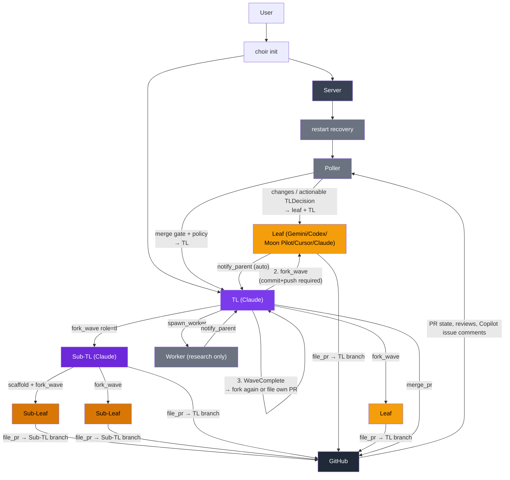

# Choir

English | [简体中文](README.zh.md)

A local agent orchestrator built in MoonBit. One expensive model thinks
(Claude as team lead), cheaper models implement (Gemini, Codex, Moon Pilot,
Cursor Agent as leaves). Each leaf gets its own git worktree, files a PR
targeting the TL's branch, and a built-in poller automates Copilot review
requests, routes review/CI feedback to the right pane, and tells the TL
when a PR is merge-ready. The core loop is **scaffold → fork → converge**:
the TL commits shared types, forks a wave of parallel leaves, merges their
PRs one at a time, then either forks another wave or files its own PR upward.

Orchestration logic is pure — typed effect planners with no direct I/O.
Host adapters (Git, GitHub, Zellij, filesystem) are injected and testable.

## VSDD Pipeline

Choir's TL follows a built-in **[Verify-Spec-Develop-Deploy](https://gist.github.com/dollspace-gay/45c95ebfb5a3a3bae84d8bebd662cc25)** pipeline for every feature request:

1. **Spec Crystallization** — TL helps articulate the behavioral contract (preconditions, edge cases, purity boundary). Spec is written to a Chainlink issue as a `plan` comment.
2. **TDD Red Gate** — Leaves write all tests first, commit, push, confirm every new test fails, then `notify_parent "[RED GATE]"` and wait. The TL spawns a research worker to verify the failures, then sends the green light.
3. **Code Review Gate** — GitHub PR review (Copilot) is the review gate. Leaves address all feedback until the PR is approved.
4. **Convergence** — TL reports convergence to the user and merges after Copilot approval.

## Chainlink

Choir integrates with [Chainlink](https://github.com/dollspace-gay/chainlink), a local Git-backed issue tracker with typed comment kinds (`plan`, `decision`, `observation`, `result`, `handoff`).

```bash
chainlink issue create "Feature title"       # create issue, get ID
chainlink issue comment <id> "<spec>" --kind plan   # write spec
chainlink_next                               # pick up next in-progress issue
chainlink_show <id>                          # load issue + comments
```

When `fork_wave` is called with an `issue_id`, each leaf's `TaskContract` is automatically enriched from the Chainlink issue:

- **goal** — falls back to issue title if the leaf task has no explicit goal
- **review_context** — issue description + last 5 plan/decision comments (sorted by id), appended to any TL-supplied context with a separator
- **constraints** — `blocked_by` entries merged in without duplication

The pure function `task_contract_from_chainlink_issue` maps a `ChainlinkIssue` to a `TaskContract`; `merge_chainlink_into_task_contract` handles the enrichment merge logic.

```
choir init
  Server (persistent, UDS)
    TL (Claude)
      │  1. scaffold commit (shared types/stubs)
      │  2. fork_wave ──▶ Leaf A ──file_pr──▶ PR → TL branch
      │              ──▶ Leaf B ──file_pr──▶ PR → TL branch
      │                     │
      │        Poller ◀─ review/CI/issue comments ──▶ Leaf (fix)
      │        Poller ──▶ TL (merge per policy + snapshot)
      │  3. WaveComplete → fork_wave again (wave 2) or file own PR up
      │
      └── optional: fork_wave(role=tl) ──▶ Sub-TL
                      Sub-TL runs same scaffold-fork-converge cycle
                      Sub-TL files PR → TL branch when done
```

## Quick Start

```bash
choir init              # bring up server + TL session
choir stop              # shut down server, keep recovery state
choir init --recreate   # restart server + TL, keep recovery state
choir stop --purge      # shut down and remove worktrees/state
```

## Build

```bash
moon build --target native --release
moon test --target native
moon fmt
```

Optional pre-commit hook:

```bash
git config core.hooksPath .githooks   # runs moon fmt + moon check
```

## Runtime Dependencies

- `git`, `gh` (PR workflow), `zellij` 0.44+ (session management)
- Agent CLIs you use: `claude`, `gemini`, `moon`, `codex`, `agent` (Cursor)
- Nix dev shell provides the open-source deps; proprietary CLIs need separate install

## CLI Tool Access

```bash
choir tool agent_list
choir tool fork_wave --caller-role tl --json '{"caller_id":"root","tasks":["task A","task B"]}'
```

Responses: `{"ok":true,"result":{...}}` or `{"ok":false,"error":"..."}`.

## Smoke Tests

```bash
choir smoke             # MCP bridge smoke
choir smoke --leafs     # live spawn/PR smoke
choir smoke --review    # live review delivery smoke
choir smoke --e2e-live  # full spawn/review/merge smoke
```

## Flow



## Releases

```bash
./scripts/release.sh patch
```

Binaries: `choir-linux-x86_64`, `choir-macos-arm64`, `SHA256SUMS`. Version source of truth: `moon.mod.json`.

## Nix

```bash
nix develop   # reproducible dev shell with MoonBit toolchain
```

## Acknowledgements

Architecture informed by [exomonad](https://github.com/tidepool-heavy-industries/exomonad). The tree-of-agents model, scaffold-fork-converge pattern, role context files, and several workflow conventions originated there.

## License

MIT
