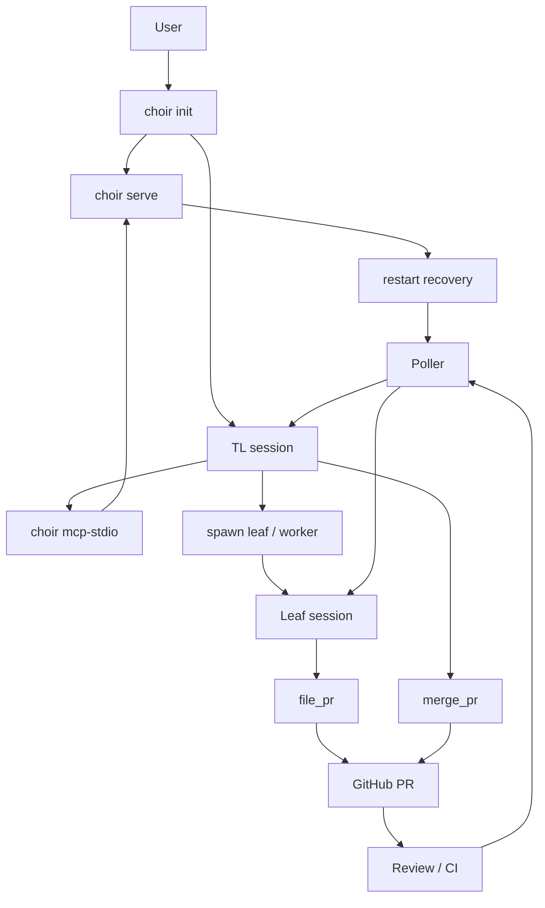

# Choir

English | [简体中文](README.zh.md)

## Name

`choir` - MoonBit agent orchestration server.

## Synopsis

```bash
choir init
choir serve
choir mcp-stdio
choir smoke
```

## Description

Choir runs a persistent local server and coordinates coding agents in isolated
workspaces.

- local transport: UDS by default
- optional transport: TCP
- local terminal backends: `tmux`, `zellij`
- agent CLIs: Claude, Gemini, Moon Pilot
- workflow: spawn, message, file PR, track review, merge, recover after restart

## Build

```bash
moon check
moon test --target native
moon build --target native --release
moon fmt
```

## Quick Start

```bash
choir init
```

This brings up:

- one persistent server session
- one TL client session
- local state under `.choir/`

## Flow



## Files

```text
.choir/config.toml        main config
.choir/server.sock        local UDS socket
.choir/tasks/             task files
.choir/kv/                key-value store
.choir/worktrees/         spawned worktrees
CLAUDE.md                 operator/developer notes
AGENTS.md                 leaf-agent instructions
```

## Status

- local UDS workflow: proven
- `tmux` backend: proven
- `zellij` backend: working
- live leaf/review/merge smokes: present
- TCP/remote path: implemented, less proven than local UDS
- Claude `--channels`: not usable for manual MCP servers yet

## See Also

- [CLAUDE.md](CLAUDE.md)
- [AGENTS.md](AGENTS.md)
