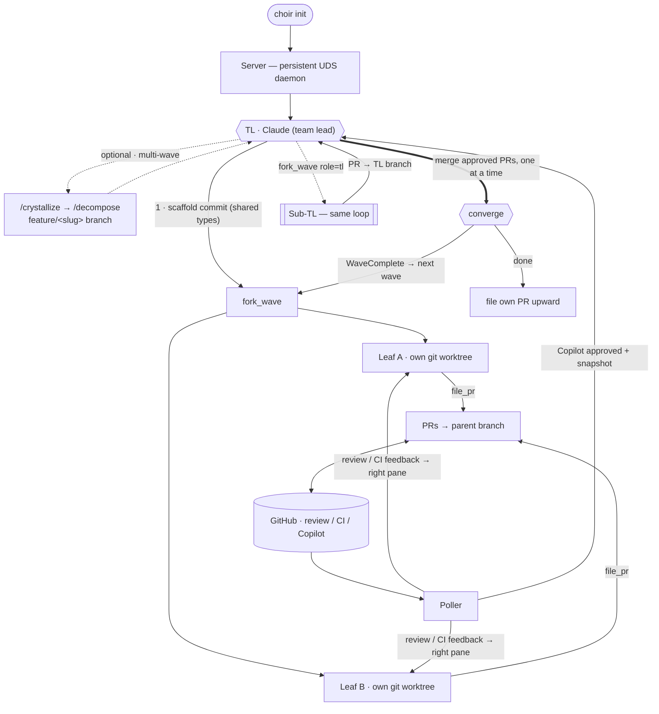

# Choir

English | [简体中文](README.zh.md)

> [!NOTE]
> This is primarily used for my own workflows, so it may change as they / the space evolve.

Choir is a local agent orchestrator written in MoonBit. One expensive model is the **team lead** (Claude); cheaper agents — Codex by default, or Gemini / Moon Pilot / Cursor — run as **leaves**. Each leaf works in its own git worktree and files a PR back to the TL's branch. A built-in **poller** automates Copilot review, routes GitHub review/CI feedback to the right pane, and tells the TL when a PR is approved. The loop is **scaffold → fork → converge**: the TL commits shared types, forks a wave of parallel leaves, merges approved PRs one at a time, then forks another wave or files its own PR upward.



> The rest is meant to be discovered by *using* it — the TL's slash-commands and MCP tools are self-describing. Spin it up and ask.

## Install

```bash
# prerequisites: git, gh, zellij 0.44+, bd (Beads), and the agent CLIs you use
#   (claude, codex, gemini, moon, agent). The Nix dev shell provides the OSS deps.

moon build --target native --release   # build
choir init                             # bring up the server + TL session
```

```bash
choir claude [--lean]    # restart the TL pane on a running server (--lean: no default system prompt)
choir init --recreate    # restart server + TL, keep recovery state
choir stop [--purge]     # shut down (--purge also removes worktrees + state)
```

## License

MIT — architecture informed by [exomonad](https://github.com/tidepool-heavy-industries/exomonad).
