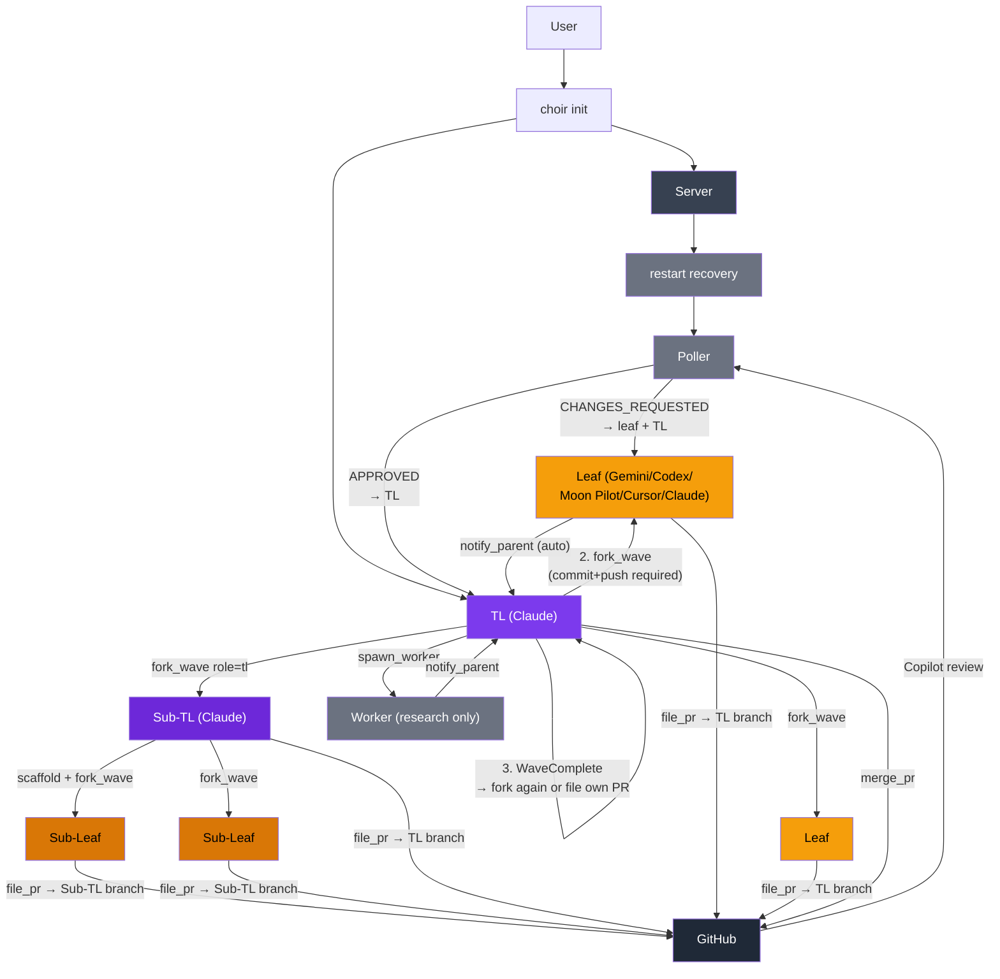

# Choir

English | [简体中文](README.zh.md)

A local agent orchestrator built in MoonBit. Use your expensive subscription
to think (Claude as team lead), and cheaper or specialized subscriptions to
implement (Gemini, Codex, Moon Pilot, Cursor Agent as leaf agents). Each leaf works in its
own git worktree, files a PR targeting the TL's branch when done, and receives
GitHub Copilot review feedback automatically via a built-in poller. The TL
merges approved PRs and can fork further waves — or file its own PR upward.

```
choir init
  Server (persistent, UDS)
    TL (Claude)
      │  1. scaffold commit (shared types/stubs)
      │  2. fork_wave ──▶ Leaf A ──file_pr──▶ PR → TL branch
      │              ──▶ Leaf B ──file_pr──▶ PR → TL branch
      │                     │
      │        Poller ◀─ Copilot review ──▶ Leaf (fix)
      │        Poller ──▶ TL (merge when approved)
      │  3. WaveComplete → fork_wave again (wave 2) or file own PR up
      │
      └── optional: fork_wave(role=tl) ──▶ Sub-TL
                      Sub-TL runs same scaffold-fork-converge cycle
                      Sub-TL files PR → TL branch when done
```

## Synopsis

```bash
choir init              # bring up server + TL session
choir stop              # shut down server, preserving recoverable state
choir stop --purge      # shut down server and remove recoverable state/worktrees
choir serve             # run server directly
choir tool agent_list   # call a Choir tool directly (JSON response)
choir mcp-stdio         # MCP JSON-RPC bridge (one per agent)
choir smoke             # MCP bridge smoke test
choir smoke --leafs     # live spawn/PR smoke
choir smoke --review    # live review delivery smoke
choir smoke --e2e-live  # full spawn/review/merge smoke
```

## Build

```bash
moon check
moon test --target native
moon build --target native --release
moon fmt
```

## Verification

Optional local hook setup:

```bash
git config core.hooksPath .githooks
```

The repo provides a normal `pre-commit` hook that runs:

- `moon fmt`
- `moon check --target native`

## Runtime Dependencies

The release artifact is the `choir` executable, but the workflow also expects
some external tools.

- required: `git`
- required for PR workflow: `gh`
- required for local session management: `zellij` (0.44+)
- required for the agent CLIs you actually use: `claude`, `gemini`, `moon`, `codex`, `agent` (Cursor)

The Nix dev shell includes the open-source dependencies above. Proprietary
agent CLIs still need to be installed and authenticated separately.

## Releases

Native binaries are intended to ship through GitHub Releases.

- `choir-linux-x86_64`
- `choir-macos-arm64`
- `SHA256SUMS`

Release source of truth: `moon.mod.json`.

Release cut:

```bash
./scripts/release.sh patch
```

## Nix

```bash
nix develop
```

The flake currently provides a reproducible development shell and MoonBit
toolchain for Choir. It does not yet expose a standalone `nix build .#choir`
package.

## Quick Start

```bash
choir init
```

This brings up:

- one persistent server session
- one TL client session
- local state under `.choir/`

`choir init --recreate` recreates the server/TL session while preserving recoverable agent state by default. Add `--purge` for a clean teardown that removes worktrees, inline metadata, lifecycles, and poller state.

Useful split:

```bash
choir stop                 # stop, keep recovery state
choir init --recreate      # restart, keep recovery state
choir stop --purge         # stop and remove recovery state
choir init --recreate --purge  # restart from a clean slate
```

### Pi Team Lead

```bash
choir init --tl pi
```

This launches Pi as the TL using Choir-managed runtime assets under `.choir/pi/`.
Choir keeps Pi state local to the repo and seeds `.choir/pi/agent/auth.json` from `~/.pi/agent/auth.json` if present. If no auth snapshot is available, log in inside the spawned Pi session.

This path is now live-validated for:
- Pi TL spawning Pi workers via `spawn_worker`
- Pi TL spawning Pi dev leafs via `fork_wave`
- Pi worker `notify_parent`
- Pi dev leaf PR open / review-followup loop
- Pi TL merging a child PR via `merge_pr`
- restart recovery of an offline PR-owning Pi leaf, including post-restart `agent_list` visibility and `merge_pr`

Remaining polish is mostly around longer-term persistence policy / delivery tradeoffs, not basic end-to-end viability.

#### Pi smoke matrix

| Flow | Status |
| --- | --- |
| `choir init --tl pi` | validated |
| Pi TL → `spawn_worker(agent_type=pi)` | validated |
| Pi worker → `notify_parent` | validated |
| Pi TL → `fork_wave(agent_type=pi)` | validated |
| Pi dev leaf → `file_pr` | validated |
| Pi dev leaf → review-followup loop | validated |
| Pi TL → `merge_pr` | validated |
| Immediate `agent_list` child visibility after spawn | hardened |
| Offline Pi leaf visible after `choir stop` + `choir init --recreate --tl pi` | validated |
| Restarted Pi TL → `merge_pr` for recovered offline leaf PR | validated |

### Pi leafs and workers

Pi is also available as an agent type for spawned children:

- `fork_wave(..., agent_type=pi)`
- `spawn_worker(..., agent_type=pi)`

This path is still experimental, but the local runtime assets and launch wiring are now in place under Choir-owned `.choir/pi/` state, and live smoke validation has confirmed end-to-end worker and dev-leaf flows.

## CLI Tool Access

Choir's server tools can also be called directly over the local control plane.
This is useful for shell automation and non-MCP integrations.

```bash
choir tool agent_list
choir tool mutex_status --name review-lock
choir tool fork_wave --caller-role tl --json '{"caller_id":"root","tasks":["task A","task B"],"agent_type":"gemini","parent_branch":"main"}'
```

Responses are JSON using Choir's normal internal envelope:

```json
{"ok":true,"result":{...}}
```

## Smoke Tests

```bash
choir smoke
choir smoke --companions
choir smoke --leafs
choir smoke --review
choir smoke --e2e-live
```

- `choir smoke`: MCP bridge/runtime smoke
- `choir smoke --companions`: `init` companion isolation smoke
- `choir smoke --leafs`: live Moon Pilot + Gemini spawn/PR smoke
- `choir smoke --review`: live review delivery smoke
- `choir smoke --e2e-live`: live spawn/review/merge smoke

## Flow

The core pattern is **scaffold → fork → converge**, optionally repeated across
multiple waves or delegated to a sub-TL.



## Files

```text
.choir/config.toml        main config
.choir/server.sock        local UDS socket
.choir/tasks/             task files
.choir/kv/                key-value store
.choir/worktrees/         spawned worktrees
.choir/inline/            recovery metadata for inline agents
.choir/hooks/hook.wasm    optional WASM hook plugin
.choir/rewrite_rules.json optional PII rewrite rules
.choir/context/common.md  shared Choir guidance
.choir/context/dev.md     leaf-agent guidance
.choir/context/tl.md      TL guidance
.choir/context/worker.md  worker guidance
```

## WASM Hooks

Choir supports WASM plugins for Gemini model hooks (BeforeModel/AfterModel)
via [extism](https://extism.org/). The plugin is written in MoonBit using the
`extism/moonbit-pdk` and compiled to WASM.

### Setup

```bash
# install extism CLI (host runtime)
curl -s https://get.extism.org/cli | sh -s -- -v v1.6.2 -y
extism lib install --prefix ~/.local

# build the hook plugin
cd hooks
moon build --target wasm --release

# install to project
cp _build/wasm/release/build/src/src.wasm ../.choir/hooks/hook.wasm
```

When `.choir/hooks/hook.wasm` exists, Gemini agents automatically get
BeforeModel/AfterModel hooks in their settings. No plugin = no hooks.

### What the plugin does

- **before_model**: rewrites PII in LLM requests (real terms to tokens)
- **after_model**: reverses rewrites in LLM responses (tokens to real terms)
- **pre_tool_use**: blocks known Gemini failure patterns (pragma corruption, read-only Json constructors)

### Rewrite rules

Create `.choir/rewrite_rules.json`:

```json
[
  {"real": "Acme Corp", "token": "COMPANY_ALPHA"},
  {"real": "john@acme.com", "token": "EMAIL_ONE"}
]
```

Pass rules via extism config when calling the plugin. Without rules,
the plugin passes input through unchanged.

## Architecture Notes

### Scaffold-Fork-Converge

`fork_wave` enforces that the TL's working tree is clean and pushed before
spawning. Children fork from the TL's HEAD, so any scaffold work (shared
types, stubs, CLAUDE.md changes) committed before the fork is automatically
inherited by all leaves in the wave. This is the same invariant as exomonad's
pre-fork git state check.

### Multi-Wave

After all leaves in a wave are merged the TL lifecycle reaches `WaveComplete`.
The TL can then fork a second wave that builds on the merged output of the
first, repeating until ready to file its own PR upward. This is the
hylomorphism: unfold (fork waves downward), fold (merge upward).

### Sub-TL

`fork_wave role=tl` spawns a child with full TL capability — it can scaffold,
fork its own wave of leaves, merge them, and file a PR to the parent TL's
branch. Sub-TL nesting is unbounded; depth is tracked for informational
purposes.

### Effect Architecture

The `fork_wave` execution path is modelled as a pure `Eff[A]` tree (scaffold
gate checks + spawn commands) interpreted by an async trampoline. The plan
is pure data; no IO runs until `interpret` is called. Tests walk the tree
directly without mocks or async infrastructure.

## Status

- local UDS workflow: proven
- zellij backend (0.44+): proven
- leaf agents: Claude, Gemini, Moon Pilot, Codex, Cursor Agent
- structured logging: [moontrace](https://github.com/brickfrog/moontrace) with colored output and OTLP span export
- multi-wave lifecycle (WaveComplete): implemented
- sub-TL nesting (role=tl): implemented, unbounded depth
- scaffold gate (commit+push before fork): enforced
- typed errors (ParseError, ForkWaveError, ChoirError): implemented
- StateMachine trait (machine_name, can_exit): implemented
- live companion/leaf/review/merge smokes: present
- TCP/remote path: implemented, less proven than local UDS

## Acknowledgements

Choir's architecture is informed by [exomonad](https://github.com/tidepool-heavy-industries/exomonad), a Rust/WASM agent orchestration framework. The tree-of-agents model, scaffold-fork-converge pattern, role context files, and several workflow conventions originated there.

## License

MIT

## See Also

- [`.choir/context/common.md`](.choir/context/common.md)
- [`.choir/context/dev.md`](.choir/context/dev.md)
- [`.choir/context/tl.md`](.choir/context/tl.md)
- [`.choir/context/worker.md`](.choir/context/worker.md)
