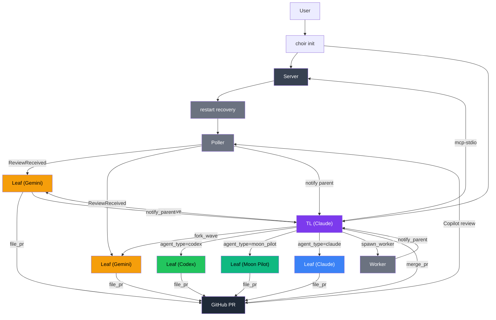

# Choir

English | [简体中文](README.zh.md)

A local agent orchestrator built in MoonBit. Use your expensive subscription
to think (Claude as team lead), and cheaper or specialized subscriptions to
implement (Gemini, Codex, Moon Pilot as leaf agents). Each leaf works in its
own git worktree, files a PR when done, and receives GitHub Copilot review
feedback automatically via a built-in poller. The TL merges approved PRs and
collapses everything back to main.

```
choir init
  Server (persistent, UDS)
    TL (Claude) ──fork_wave──▶ Leaf (Gemini/Codex/Moon Pilot) ──file_pr──▶ GitHub PR
                                                                               │
                               Poller ◀── Copilot review ─────────────────────┘
                               Poller ──▶ Leaf (fix review comments)
                               Poller ──▶ TL   (merge when approved)
```

## Synopsis

```bash
choir init              # bring up server + TL session
choir stop              # shut down server
choir serve             # run server directly
choir mcp-stdio         # MCP JSON-RPC bridge (one per agent)
choir smoke             # MCP bridge smoke test
choir smoke --leafs     # live spawn/PR smoke
choir smoke --review    # live review delivery smoke
choir smoke --e2e-live  # full spawn/review/merge smoke
```

## Build

```bash
moon check
moon test --target native
moon build --target native --release
moon fmt
```

## Runtime Dependencies

The release artifact is the `choir` executable, but the workflow also expects
some external tools.

- required: `git`
- required for PR workflow: `gh`
- required for local session management: `zellij` (0.44+)
- required for the agent CLIs you actually use: `claude`, `gemini`, `moon`, `codex`

The Nix dev shell includes the open-source dependencies above. Proprietary
agent CLIs still need to be installed and authenticated separately.

## Releases

Native binaries are intended to ship through GitHub Releases.

- `choir-linux-x86_64`
- `choir-macos-arm64`
- `SHA256SUMS`

Release source of truth: `moon.mod.json`.

Release cut:

```bash
./scripts/release.sh patch
```

## Nix

```bash
nix develop
```

The flake currently provides a reproducible development shell and MoonBit
toolchain for Choir. It does not yet expose a standalone `nix build .#choir`
package.

## Quick Start

```bash
choir init
```

This brings up:

- one persistent server session
- one TL client session
- local state under `.choir/`

## Smoke Tests

```bash
choir smoke
choir smoke --companions
choir smoke --leafs
choir smoke --review
choir smoke --e2e-live
```

- `choir smoke`: MCP bridge/runtime smoke
- `choir smoke --companions`: `init` companion isolation smoke
- `choir smoke --leafs`: live Moon Pilot + Gemini spawn/PR smoke
- `choir smoke --review`: live review delivery smoke
- `choir smoke --e2e-live`: live spawn/review/merge smoke

## Flow



## Files

```text
.choir/config.toml        main config
.choir/server.sock        local UDS socket
.choir/tasks/             task files
.choir/kv/                key-value store
.choir/worktrees/         spawned worktrees
.choir/hooks/hook.wasm    optional WASM hook plugin
.choir/rewrite_rules.json optional PII rewrite rules
CLAUDE.md                 operator/developer notes
AGENTS.md                 leaf-agent instructions
```

## WASM Hooks

Choir supports WASM plugins for Gemini model hooks (BeforeModel/AfterModel)
via [extism](https://extism.org/). The plugin is written in MoonBit using the
`extism/moonbit-pdk` and compiled to WASM.

### Setup

```bash
# install extism CLI (host runtime)
curl -s https://get.extism.org/cli | sh -s -- -v v1.6.2 -y
extism lib install --prefix ~/.local

# build the hook plugin
cd hooks
moon build --target wasm --release

# install to project
cp _build/wasm/release/build/src/src.wasm ../.choir/hooks/hook.wasm
```

When `.choir/hooks/hook.wasm` exists, Gemini agents automatically get
BeforeModel/AfterModel hooks in their settings. No plugin = no hooks.

### What the plugin does

- **before_model**: rewrites PII in LLM requests (real terms to tokens)
- **after_model**: reverses rewrites in LLM responses (tokens to real terms)
- **pre_tool_use**: blocks known Gemini failure patterns (pragma corruption, read-only Json constructors)

### Rewrite rules

Create `.choir/rewrite_rules.json`:

```json
[
  {"real": "Acme Corp", "token": "COMPANY_ALPHA"},
  {"real": "john@acme.com", "token": "EMAIL_ONE"}
]
```

Pass rules via extism config when calling the plugin. Without rules,
the plugin passes input through unchanged.

## Status

- local UDS workflow: proven
- zellij backend (0.44+): proven
- leaf agents: Claude, Gemini, Moon Pilot, Codex
- structured logging: [moontrace](https://github.com/brickfrog/moontrace) with colored output and OTLP span export
- live companion/leaf/review/merge smokes: present
- TCP/remote path: implemented, less proven than local UDS

## Acknowledgements

Choir's architecture is informed by [exomonad](https://github.com/tidepool-heavy-industries/exomonad), a Rust/WASM agent orchestration framework. The tree-of-agents model, role context files, prompt-via-temp-file pattern, and several workflow conventions originated there.

## License

MIT

## See Also

- [CLAUDE.md](CLAUDE.md)
- [AGENTS.md](AGENTS.md)
