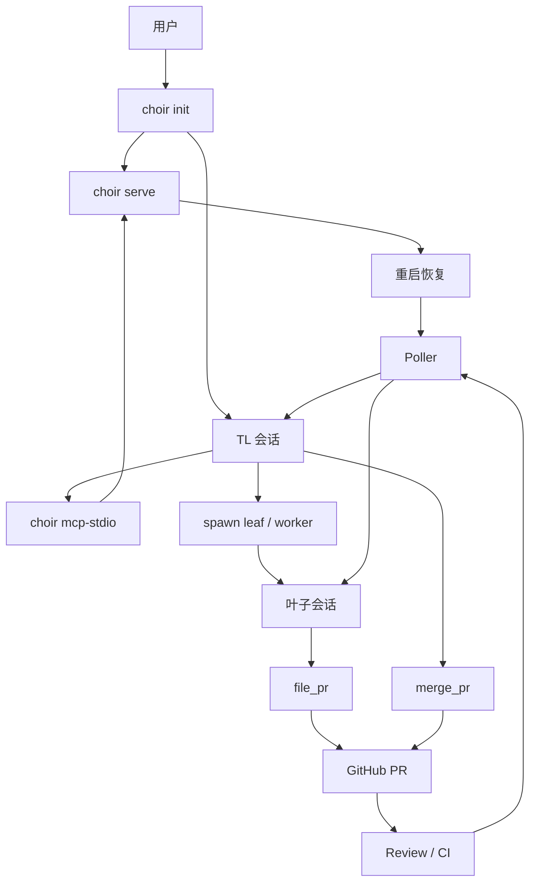

# Choir

[English](README.md) | 简体中文

## 名称

`choir` - 用 MoonBit 编写的多代理编排服务。

## 概要

```bash
choir init
choir serve
choir mcp-stdio
choir smoke
```

## 说明

Choir 运行一个常驻本地服务，并在隔离工作区中协调多个编码代理。

- 本地传输：默认 UDS
- 可选传输：TCP
- 本地终端后端：`tmux`、`zellij`
- 代理 CLI：Claude、Gemini、Moon Pilot
- 工作流：spawn、消息传递、提 PR、跟踪 review、合并、重启恢复

## 构建

```bash
moon check
moon test --target native
moon build --target native --release
moon fmt
```

## 运行依赖

发布产物主要是 `choir` 可执行文件，但完整工作流仍依赖一些外部工具。

- 必需：`git`
- PR 工作流必需：`gh`
- 本地会话管理必需：`tmux` 或 `zellij`
- 你实际使用到的代理 CLI：`claude`、`gemini`、`moon`

Nix dev shell 会提供上面的开源依赖。专有代理 CLI 仍需要你自行安装并完成认证。

## Releases

原生二进制计划通过 GitHub Releases 分发。

- `choir-linux-x86_64`
- `choir-macos-arm64`
- `SHA256SUMS`

## Nix

```bash
nix develop
```

当前 flake 提供的是 Choir 的可复现开发环境和 MoonBit 工具链；暂时还没有
暴露独立的 `nix build .#choir` 打包产物。

## 快速开始

```bash
choir init
```

该命令会拉起：

- 一个常驻服务会话
- 一个 TL 客户端会话
- 位于 `.choir/` 的本地状态目录

## 流程



## 文件

```text
.choir/config.toml        主配置
.choir/server.sock        本地 UDS socket
.choir/tasks/             任务文件
.choir/kv/                键值存储
.choir/worktrees/         派生工作树
CLAUDE.md                 操作/开发说明
AGENTS.md                 叶子代理说明
```

## 状态

- 本地 UDS 工作流：已验证
- `tmux` 后端：已验证
- `zellij` 后端：可用
- 叶子代理 / review / merge 的 live smoke：已具备
- TCP/remote 路径：已实现，但验证程度低于本地 UDS
- Claude `--channels`：目前还不能用于手动配置的 MCP 服务

## 另见

- [CLAUDE.md](CLAUDE.md)
- [AGENTS.md](AGENTS.md)
