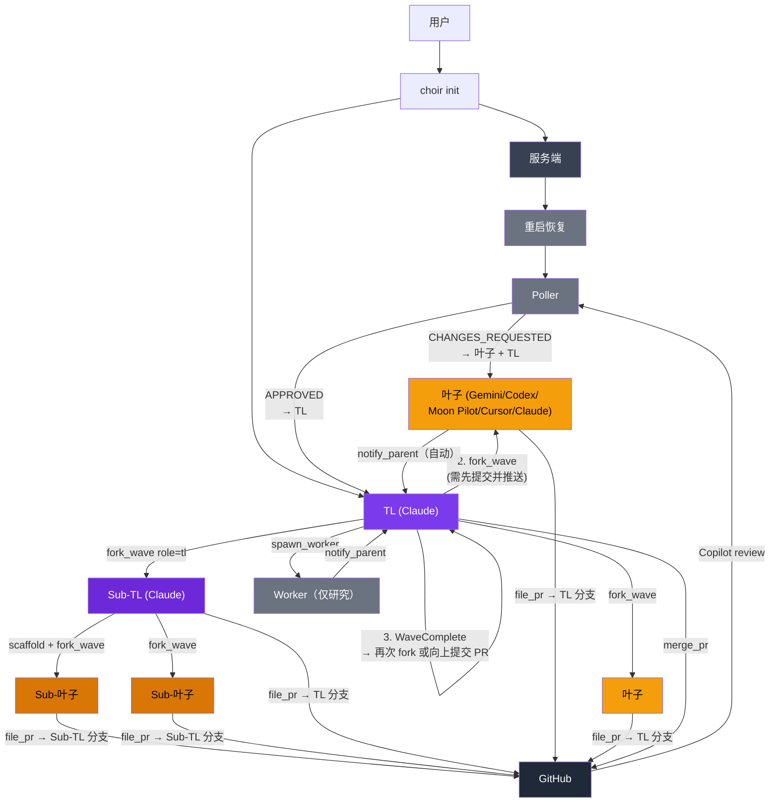

# Choir

[English](README.md) | 简体中文

用 MoonBit 编写的本地多代理编排器。用昂贵的模型来思考（Claude 担任 TL），
用更便宜或更专业的模型来实现（Gemini、Codex、Moon Pilot、Cursor Agent 作为叶子代理）。
每个叶子在独立的 git worktree 中工作，完成后向 TL 分支提交 PR。内置 poller 自动请求
Copilot review、将 review/CI 反馈路由到对应面板、在 PR 可合并时通知 TL。
核心循环是 **scaffold → fork → converge**：TL 提交共享类型，派生一波并行叶子，
逐一合并 PR，然后继续下一波或向上提交自己的 PR。

编排逻辑是纯函数式的——类型化 effect 规划器，无直接 I/O。宿主适配器（Git、GitHub、Zellij、文件系统）通过注入方式提供，可测试。架构参考了 [exomonad](https://github.com/tidepool-heavy-industries/exomonad)。

```
choir init
  服务端 (常驻, UDS)
    TL (Claude)
      │  1. scaffold 提交（共享类型/存根）
      │  2. fork_wave ──▶ 叶子 A ──file_pr──▶ PR → TL 分支
      │              ──▶ 叶子 B ──file_pr──▶ PR → TL 分支
      │                     │
      │        Poller ◀─ Copilot review ──▶ 叶子（修复）
      │        Poller ──▶ TL（通过后合并）
      │  3. WaveComplete → 再次 fork_wave（第 2 波）或向上提交 PR
      │
      └── 可选：fork_wave(role=tl) ──▶ Sub-TL
                    Sub-TL 运行同样的 scaffold-fork-converge 循环
                    Sub-TL 完成后向 TL 分支提交 PR
```

## 快速开始

```bash
choir init              # 拉起服务端 + TL 会话
choir stop              # 停止，保留恢复状态
choir init --recreate   # 重启，保留恢复状态
choir stop --purge      # 停止并清除工作树/状态
```

## 构建

```bash
moon build --target native --release
moon test --target native
moon fmt
```

可选的 pre-commit hook：

```bash
git config core.hooksPath .githooks   # 运行 moon fmt + moon check
```

## 运行依赖

- `git`、`gh`（PR 工作流）、`zellij` 0.44+（会话管理）
- 你使用的代理 CLI：`claude`、`gemini`、`moon`、`codex`、`agent`（Cursor）
- Nix dev shell 提供开源依赖；专有 CLI 需单独安装

## CLI 工具访问

```bash
choir tool agent_list
choir tool fork_wave --caller-role tl --json '{"caller_id":"root","tasks":["task A","task B"]}'
```

响应：`{"ok":true,"result":{...}}` 或 `{"ok":false,"error":"..."}`。

## Smoke 测试

```bash
choir smoke             # MCP bridge smoke
choir smoke --leafs     # live spawn/PR smoke
choir smoke --review    # live review 回流 smoke
choir smoke --e2e-live  # 完整 spawn/review/merge smoke
```

## 流程



## Releases

```bash
./scripts/release.sh patch
```

二进制：`choir-linux-x86_64`、`choir-macos-arm64`、`SHA256SUMS`。版本单一来源：`moon.mod.json`。

## Nix

```bash
nix develop   # 可复现开发环境 + MoonBit 工具链
```

## 致谢

架构参考了 [exomonad](https://github.com/tidepool-heavy-industries/exomonad)。代理树模型、scaffold-fork-converge 模式、角色上下文文件及若干工作流约定均源自该项目。

## 许可证

MIT
