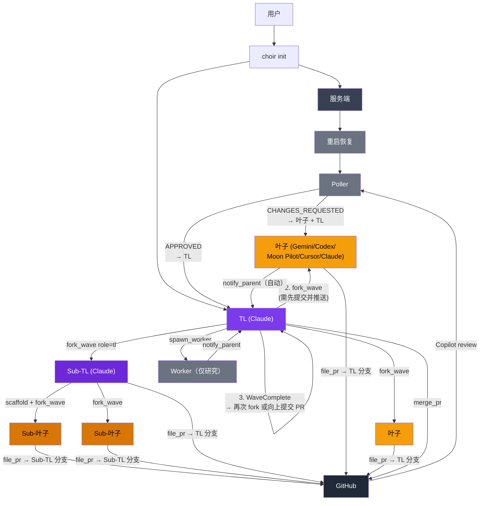

# Choir

[English](README.md) | 简体中文

用 MoonBit 编写的本地多代理编排器。用你昂贵的订阅来思考（Claude 担任 TL），
用更便宜或更专业的订阅来实现（Gemini、Codex、Moon Pilot、Cursor Agent 作为叶子代理）。
每个叶子代理在独立的 git worktree 中工作，完成后提交 PR，目标为 TL 的分支。
内置 poller 自动接收 GitHub Copilot 的 review 反馈。TL 合并通过的 PR，
可以继续派生下一个 wave，也可以向上提交自己的 PR。

```
choir init
  服务端 (常驻, UDS)
    TL (Claude)
      │  1. scaffold 提交（共享类型/存根）
      │  2. fork_wave ──▶ 叶子 A ──file_pr──▶ PR → TL 分支
      │              ──▶ 叶子 B ──file_pr──▶ PR → TL 分支
      │                     │
      │        Poller ◀─ Copilot review ──▶ 叶子（修复）
      │        Poller ──▶ TL（通过后合并）
      │  3. WaveComplete → 再次 fork_wave（第 2 波）或向上提交 PR
      │
      └── 可选：fork_wave(role=tl) ──▶ Sub-TL
                    Sub-TL 运行同样的 scaffold-fork-converge 循环
                    Sub-TL 完成后向 TL 分支提交 PR
```

## 概要

```bash
choir init              # 拉起服务端 + TL 会话
choir stop              # 关闭服务端
choir serve             # 直接运行服务端
choir mcp-stdio         # MCP JSON-RPC 桥接（每个代理一个）
choir smoke             # MCP bridge smoke 测试
choir smoke --leafs     # live spawn/PR smoke
choir smoke --review    # live review 回流 smoke
choir smoke --e2e-live  # 完整 spawn/review/merge smoke
```

## 构建

```bash
moon check
moon test --target native
moon build --target native --release
moon fmt
```

## 校验

可选的本地 hook 配置：

```bash
git config core.hooksPath .githooks
```

仓库提供了标准 `pre-commit` hook，会运行：

- `moon fmt`
- `moon check --target native`

## 运行依赖

发布产物主要是 `choir` 可执行文件，但完整工作流仍依赖一些外部工具。

- 必需：`git`
- PR 工作流必需：`gh`
- 本地会话管理必需：`zellij`（0.44+）
- 你实际使用到的代理 CLI：`claude`、`gemini`、`moon`、`codex`、`agent`（Cursor）

Nix dev shell 会提供上面的开源依赖。专有代理 CLI 仍需要你自行安装并完成认证。

## Releases

原生二进制计划通过 GitHub Releases 分发。

- `choir-linux-x86_64`
- `choir-macos-arm64`
- `SHA256SUMS`

版本单一来源：`moon.mod.json`。

发版命令：

```bash
./scripts/release.sh patch
```

## Nix

```bash
nix develop
```

当前 flake 提供的是 Choir 的可复现开发环境和 MoonBit 工具链；暂时还没有
暴露独立的 `nix build .#choir` 打包产物。

## 快速开始

```bash
choir init
```

该命令会拉起：

- 一个常驻服务会话
- 一个 TL 客户端会话
- 位于 `.choir/` 的本地状态目录

## Smoke 测试

```bash
choir smoke
choir smoke --companions
choir smoke --leafs
choir smoke --review
choir smoke --e2e-live
```

- `choir smoke`：MCP bridge / runtime smoke
- `choir smoke --companions`：`init` companion 隔离 smoke
- `choir smoke --leafs`：Moon Pilot + Gemini 的 live spawn/PR smoke
- `choir smoke --review`：live review 回流 smoke
- `choir smoke --e2e-live`：live spawn/review/merge smoke

## 流程

核心模式是 **scaffold → fork → converge**，可在多个 wave 中重复，也可委托给 Sub-TL。



## 文件

```text
.choir/config.toml        主配置
.choir/server.sock        本地 UDS socket
.choir/tasks/             任务文件
.choir/kv/                键值存储
.choir/worktrees/         派生工作树
.choir/hooks/hook.wasm    可选 WASM hook 插件
.choir/rewrite_rules.json 可选 PII 重写规则
.choir/context/common.md  共享 Choir 指南
.choir/context/dev.md     叶子代理指南
.choir/context/tl.md      TL 指南
.choir/context/worker.md  worker 指南
```

## WASM Hooks

Choir 通过 [extism](https://extism.org/) 支持 Gemini 模型 hook（BeforeModel/AfterModel）的 WASM 插件。插件使用 MoonBit 的 `extism/moonbit-pdk` 编写并编译为 WASM。

### 配置

```bash
# 安装 extism CLI（宿主运行时）
curl -s https://get.extism.org/cli | sh -s -- -v v1.6.2 -y
extism lib install --prefix ~/.local

# 构建 hook 插件
cd hooks
moon build --target wasm --release

# 安装到项目
cp _build/wasm/release/build/src/src.wasm ../.choir/hooks/hook.wasm
```

当 `.choir/hooks/hook.wasm` 存在时，Gemini 代理会自动启用模型 hook。无插件则无 hook。

### 插件功能

- **before_model**：重写 LLM 请求中的 PII（真实信息 → 令牌）
- **after_model**：反向重写 LLM 响应（令牌 → 真实信息）
- **pre_tool_use**：拦截已知的 Gemini 故障模式（pragma 损坏、只读 Json 构造器）

### 重写规则

创建 `.choir/rewrite_rules.json`：

```json
[
  {"real": "Acme Corp", "token": "COMPANY_ALPHA"},
  {"real": "john@acme.com", "token": "EMAIL_ONE"}
]
```

通过 extism config 传入规则。无规则时插件直接透传输入。

## 架构说明

### Scaffold-Fork-Converge

`fork_wave` 要求 TL 的工作树在派生前必须干净且已推送。子代理从 TL 的当前 HEAD 派生，
因此 fork 之前提交的所有 scaffold 工作（共享类型、存根、CLAUDE.md 变更）会被当前 wave
的所有叶子自动继承。这与 exomonad 的预 fork git 状态检查遵循相同的不变量。

### Multi-Wave（多 Wave）

当一个 wave 的所有叶子都合并后，TL 的生命周期进入 `WaveComplete`。
TL 可以基于第一个 wave 的合并输出派生第二个 wave，不断重复直到准备好向上提交自己的 PR。
这是折叠同态：向下展开（fork wave），向上折叠（merge）。

### Sub-TL

`fork_wave role=tl` 会派生一个具备完整 TL 能力的子代理——它可以 scaffold、
派生自己的叶子 wave、合并它们，并向父 TL 的分支提交 PR。
Sub-TL 嵌套深度无限制；depth 字段仅作信息用途追踪。

### Effect 架构

`fork_wave` 的执行路径被建模为纯 `Eff[A]` 树（scaffold 门控检查 + 派生命令），
由异步 trampoline 解释执行。计划是纯数据；在调用 `interpret` 之前不会执行任何 IO。
测试可直接遍历树，无需 mock 或异步基础设施。

## 状态

- 本地 UDS 工作流：已验证
- zellij 后端（0.44+）：已验证
- 叶子代理：Claude、Gemini、Moon Pilot、Codex、Cursor Agent
- 结构化日志：[moontrace](https://github.com/brickfrog/moontrace)，支持彩色输出和 OTLP span 导出
- 多 wave 生命周期（WaveComplete）：已实现
- Sub-TL 嵌套（role=tl）：已实现，深度无限制
- scaffold 门控（fork 前需提交并推送）：已强制执行
- 类型化错误（ParseError、ForkWaveError、ChoirError）：已实现
- StateMachine trait（machine_name、can_exit）：已实现
- companion / 叶子代理 / review / merge 的 live smoke：已具备
- TCP/remote 路径：已实现，但验证程度低于本地 UDS

## 致谢

Choir 的架构参考了 [exomonad](https://github.com/tidepool-heavy-industries/exomonad)（一个 Rust/WASM 多代理编排框架）。
代理树模型、scaffold-fork-converge 模式、角色上下文文件及若干工作流约定均源自该项目。

## 许可证

MIT

## 另见

- [`.choir/context/common.md`](.choir/context/common.md)
- [`.choir/context/dev.md`](.choir/context/dev.md)
- [`.choir/context/tl.md`](.choir/context/tl.md)
- [`.choir/context/worker.md`](.choir/context/worker.md)
