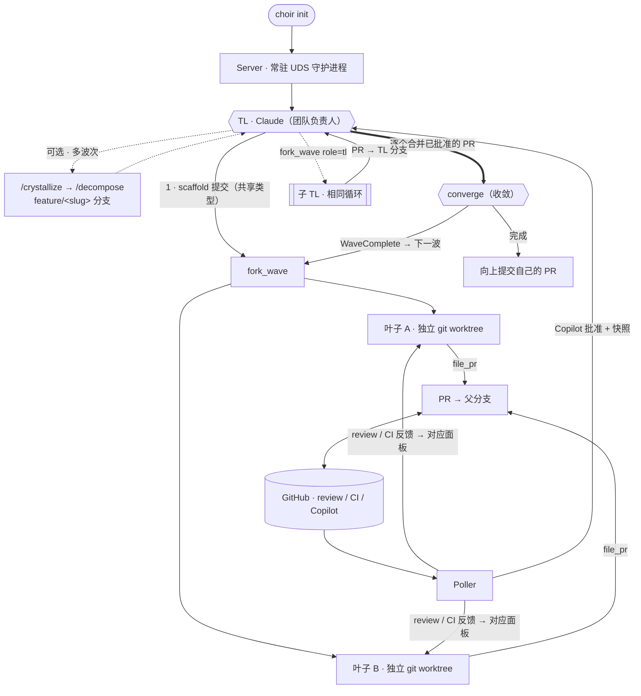

# Choir

[English](README.md) | 简体中文

> [!NOTE]
> 这个主要是给我自己的工作流程用的，所以可能会随着它们或者这个领域的发展而改变。

Choir 是一个用 MoonBit 编写的本地代理编排器。一个昂贵的模型担任 **团队负责人（TL，Claude）**；更便宜的代理作为 **叶子（leaf）** 运行——默认 Codex，也可选 Gemini / Moon Pilot / Cursor。每个叶子在自己的 git worktree 中工作，并向 TL 的分支提交 PR。内置的 **poller** 自动处理 Copilot review、把 GitHub review/CI 反馈路由到对应面板，并在 PR 获批时通知 TL。核心循环是 **scaffold → fork → converge**：TL 提交共享类型，派生一波并行叶子，逐个合并已批准的 PR，然后再派生下一波或向上提交自己的 PR。



> 其余部分应通过 *实际使用* 来发现——TL 的斜杠命令和 MCP 工具都是自描述的。启动它，直接问即可。本 README 刻意保持精简。

## 安装

```bash
# 前置依赖：git、gh、zellij 0.44+、bd（Beads），以及你要用的代理 CLI
#   （claude、codex、gemini、moon、agent）。Nix dev shell 提供开源依赖。

moon build --target native --release   # 构建
choir init                             # 拉起服务端 + TL 会话
```

```bash
choir claude [--lean]    # 在运行中的服务端上重启 TL 面板（--lean：不加默认系统提示）
choir init --recreate    # 重启服务端 + TL，保留恢复状态
choir stop [--purge]     # 关闭（--purge 同时删除 worktree + 状态）
```

## 许可证

MIT —— 架构参考了 [exomonad](https://github.com/tidepool-heavy-industries/exomonad)。
