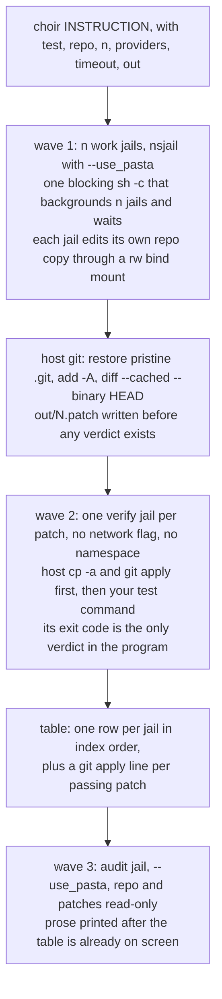

# Architecture



Six nodes is the whole program. The three waves are three functions in
`crates/choir/src/run.rs`, called in order — not a stage type, not a list of stages, and
not a pipeline.

A wave is one blocking shell-out. Choir builds one string containing one
`( nsjail … ; echo $? > <slot>.rc ) &` line per jail and a final `wait`, and runs it as
`/bin/sh -c <string>`. Measured: three jails whose longest is 4 s complete in 4.01 s wall,
not the 10 s serial sum, with exit codes 0, 5 and 137 in the right files and zero orphans.
Choir itself is still one single-threaded process making blocking external calls — no
threads, no async runtime, no concurrency library. The one POSIX-sh detail that must not
be "simplified": `A; B &` backgrounds only `B`, so the compound is parenthesised. Without
the parentheses
every jail runs in the foreground and the identical wave took 10.04 s — the full serial
sum — instead of 4.02 s.

## Paths

Choir writes in exactly two places and touches nothing else:

- `<out>/N.patch`, one per work jail. `--out` defaults to `./choir-out`, relative to the
  user's current directory. A second run with the same `--out` overwrites `N.patch`; Choir
  does not version, timestamp, or refuse.
- one `mktemp -d`, deleted before the last line of `main`. It holds `repo/` (one `cp -a` of
  `--repo`, the base for every jail, never mounted writable), `patches/` (the same bytes as
  `<out>`), and one slot directory per jail.

Every slot has the same shape: `repo/` bound read-write at `/repo`, `tmp/` at `/tmp`,
`cred/` at `/cred` holding exactly one credential file, and `cmd`, a single file bound
**read-only** at `/cmd`. The audit slot has no `repo/`: it mounts `<run>/repo` read-only,
which deletes one full copy of the repository per run. Guest paths are chosen by Choir, not
derived from host names, so `/repo`, `/patches` and `/cmd` are literals that need no
defending.

The instruction and the `--test` command travel as file contents, never as tokens. Choir
writes each verbatim to `<slot>/cmd`; the jail reads it with the fixed literal
`"$(cat /cmd)"` — with the double quotes — or runs it as `sh /cmd`, so the wave script
contains zero bytes from argv or stdin. Verified with an instruction containing double
quotes, single quotes, `$HOME`, backticks, a semicolon, a bare `*` and an embedded newline:
one argv word, byte for byte, nothing executed on the host; read unquoted the same file
split into 20 words. `/cmd` is mounted outside `/repo`, so it cannot appear in a patch.

"Zero bytes from argv or stdin" is the precise claim, and it is narrower than "zero
user-controlled bytes". Three values in the script come from the environment rather than
from a flag: the slot and run directory, which derive from `mktemp -d` and therefore
`$TMPDIR`, and the provider binary path, which derives from `command -v` and therefore
`$PATH`. None is reachable from a flag, from stdin, or from inside a jail — a jailed model
writes only under the scratch tree, which is on no `PATH`. The practical consequence is
not injection but breakage: a provider binary at a path containing a space produces an
opaque nsjail 255 that the failure model reads as a missing binary.

## Dependencies

`Cargo.toml` declares one workspace with two crates and **no third-party runtime
dependencies at all**: `choir-core` is pure `std`, and `choir` depends only on
`choir-core`. `proptest` is a dev-dependency of the core, used by the property tests and
absent from the shipped binary. The release profile is `opt-level = "z"`, LTO, one
codegen unit, `panic = "abort"`, stripped — 377 KB linking `libc` and `libgcc_s`.

## Components

**argv parse and plan.** Parses the flags in the README and produces
`List(#(index, provider))`. Provider is `providers[index mod length]`, computed once before
anything runs. The audit jail is index `n` in that same expression — no separate rule, no
`--audit-provider` flag. `--providers` accepts exactly the words `claude` and `codex`. Its
binary is whatever `/bin/sh -c 'command -v <name>'` then `readlink -f` resolves to, which is
one line and not a discovery step; on this machine `claude` is also an interactive shell
function, and the resolved path is the versioned ELF the function would have run.
Round-robin is the whole fault-tolerance story: a rate-limited Claude degrades a run
instead of ending it.

**The shell-out capture site.** One function in `crates/choir/src/sys.rs` running an argv
through `std::process::Command::output`, returning the exit code and **stdout only**.
Merging stderr would corrupt patches, because `git diff` output becomes a patch byte for
byte and git warns on stderr. A program that fails to spawn reports 255, matching
nsjail's own code for a failed mount. Anything needing a verdict reads a `.rc` file,
since a wave's exit code belongs to the wave, not to any one jail.

The UTF-8 problem the Gleam version needed an Erlang BIF for does not exist here:
provider output is read as bytes and rendered with `String::from_utf8_lossy`, so one
invalid byte is replaced rather than crashing the run.

**The jail argv builder.** Two literal argv templates — provider and verify — whose only
holes are strings: the timeout, the slot path, the repo mount, the provider binary path
and name, and the credential environment variable name. No mount-set parameter, no
network boolean, no jail-profile type; `--use_pasta`, the four networking `/etc` mounts,
`/prov`, `/cred` and `/patches` appear together or not at all, so there are two shapes, not
a matrix. The `resolv.conf` the provider template mounts is one line written once per run
into the run directory, not a template and not a parameter.

**The two provider command lines.** Two arms of one `case`, written out, no model id and
no version:

```
/prov/claude -p "$(cat /cmd)" --dangerously-skip-permissions
/prov/codex exec --skip-git-repo-check --dangerously-bypass-approvals-and-sandbox "$(cat /cmd)"
```

Each arm also yields its `-R <resolved binary>:/prov/<name>` mount and its
`-E CLAUDE_CONFIG_DIR=/cred` or `-E CODEX_HOME=/cred`. A third provider is an edit to that
`case` by someone who has run the new CLI. No provider record, no capability table.

**The wave runner.** Builds the script string, makes one blocking shell-out, reads the N
`.rc` files. Nothing is written to disk: the script is one argv element to `/bin/sh -c`.
The script itself is assembled without a temporary allocation per jail.

**Slot prep.** Two functions, not one with a flag. `prep_slot` makes `<slot>/tmp` and writes
`<slot>/cmd` — what every jail needs. `prep_provider_slot` adds `<slot>/cred` with the one
credential file and resolves the provider binary; only the work and audit waves call it,
because a verify jail mounts no `/cred` and copying the token there only widened its
footprint on disk. Each wave unlinks its jails' credentials as soon as it returns.

**Patch extraction.** The jail's `.git` is thrown away and the pristine one restored from
the base copy first — git executes commands named in a repository's own config, so running
host git inside a tree the model owned was arbitrary execution on the host, and diffing
against a `HEAD` the model could move silently discarded work when it committed. Then
host-side `git -C <run>/w<N>/repo add -A` and `git diff --cached --binary HEAD`, written to
`<out>/N.patch` and `<run>/patches/N.patch` immediately. `--binary` is not optional: without
it a binary hunk carries no full index line and `git apply` rejects the whole patch. The
jail's working tree *is* that host directory, so there is no copy-out and no git inside the
guest. Writing the files before computing any verdict is what makes it structurally
impossible for Choir to discard work a provider produced.

**Verify prep.** `cp -a <run>/repo <run>/v<N>/repo` then `git apply <out>/N.patch`, host side,
before the verify jail starts. Without it, "the patch does not apply" and "the tests failed"
collapse into one nonzero exit code. A zero-byte patch gets no verify jail and its row reads
`-`, because there is nothing to apply. A patch `git apply` rejects skips its jail too and
reads `APPLY FAILED` — the host-side apply happens before the jail starts, so a rejected
patch has no tree to test. Those two are the only conditions in the program that skip
anything, and both are mechanical facts about the patch. A size threshold, a path check, or
a "looks like it only touches tests"
heuristic is the gate this design exists to not have.

**Report.** One row per jail in index order, then a `git apply` line per passing patch, then
the audit prose. It is the entire user interface and the entire selection mechanism.

**The audit prompt.** The only string Choir itself sends to a model — one literal sentence, no
interpolation: *Read the repository at /repo and the patches at /patches. Say what is wrong
with each one.*

## The literal command lines

Every jail shares this prefix. It is one literal in the source and none of it is a flag:

```
nsjail -Mo -q -t <timeout> --disable_rlimits
  -R /usr -R /lib64 -R /bin -R /etc/passwd -R /etc/group
  -R /dev/null -R /dev/zero -R /dev/urandom -R /dev/random
  -R <slot>/cmd:/cmd -B <slot>/tmp:/tmp -D /repo
  -E PATH=/usr/local/bin:/usr/bin -E HOME=/tmp
```

A **provider jail** (the N work jails, and the audit jail) adds:

```
  --use_pasta -R <run>/resolv.conf:/etc/resolv.conf
  -R /etc/hosts -R /etc/ssl -R /etc/ca-certificates
  -R <readlink -f provider>:/prov/<name> -R <run>/patches:/patches
  -B <slot>/cred:/cred -E CLAUDE_CONFIG_DIR=/cred        (or CODEX_HOME)
  -B <slot>/repo:/repo                                   (audit: -R <run>/repo:/repo)
  -- /usr/bin/sh -c '<provider command line above>'
```

A **verify jail** adds only `-B <slot>/repo:/repo -- /usr/bin/sh /cmd`. That difference —
one flag, four `/etc` mounts, `/prov`, `/cred` and `/patches` — is the entire network policy
of the program. `/patches` is unconditional in the provider template: in wave 1 the directory
is empty and the jail starts fine, by wave 3 it holds the patches, and making it conditional
would be a mount-set parameter with one caller. Each line in the wave script ends
`< /dev/null > <slot>.log 2>&1`, because a provider CLI that reads stdin stalls, and because
merging the streams is what makes "the last line of the log" work for both CLIs (Claude
prints its status to stdout, Codex to stderr).

## Decisions

**Provider inside the jail, not proxied from the host.** Rejected: running the provider on
the host and proxying its tool calls in over MCP or a Unix socket. That is what v2 built, it
cost roughly 4,900 lines, and it does not reduce the risk it appears to address — it moves
the same unscoped OAuth token to a host process with unrestricted network.

**No `--chroot` and no `--symlink`.** Rejected: `--chroot /`, which exposes the entire host
filesystem read-only — every repository you own and your `~/.ssh`. Rejected: `--chroot <dir>`
with a prepared skeleton; it needs `--rw` on this filesystem or fails EPERM on the read-only
remount, and it cannot create a mount target that does not already exist. nsjail's own empty
tmpfs root auto-creates every destination, including nested ones. `--symlink` fails EEXIST
for any top-level destination and buys nothing.

**Four things in the flag literal that are not flags, because their defaults destroy work
silently.** `--disable_rlimits`: nsjail defaults to 32 open files, a 1 MB file-size cap, 4 GB
of address space and 600 s of CPU, so a 3 MB write is truncated to exactly 1048576 bytes and
git reports `index.lock write error: File too large` — v2's death (paid time burned, empty
patch, no distinguishable signal) reproduced by a default. A bind-mounted `/tmp`: `-T /tmp`
gives a 4 MB tmpfs that reported success on a 200 MB `dd` and kept 4 MB.
`-R /etc/passwd -R /etc/group`: without them nothing can name uid 1000, so `whoami` fails and
`getpass.getuser()` raises *No username set in the environment*. `/dev/urandom`: without it
Claude Code dies with a bare SIGSEGV and no diagnostic. Rejected: `--rlimit_fsize max`, which
reports a `ulimit -f` of 36028797018961920 and then fails *every* write with EFBIG. Rejected:
cgroups — `--cgroup_mem_max` does not hard-cap (reclaim falls through to swap; 200 MB
survived a 64 MB limit) and reaching a working cgroup needs host-layout detection. Rejected:
a seccomp policy — `--seccomp_string` enforces, but a kafel policy is an artifact to maintain
per provider and nothing requires it.

**One credential file, copied into a writable per-jail directory.** Rejected: bind-mounting
the real `~/.claude` or `~/.codex` — both CLIs write refreshed tokens there and that must not
land in the host's. Rejected: mounting the copy read-only, which does not fail loudly but
degrades: Codex prints *WARNING: proceeding, even though we could not create PATH aliases:
Read-only file system*, still reports logged in, and silently loses `apply_patch` and its
exec wrapper — a failure that looks like an auth bug months later. `CLAUDE_CONFIG_DIR` /
`CODEX_HOME` pointed at a directory holding only that one file works and everything else
self-creates, so the jail never sees host hooks, plugins, MCP servers, skills, or history.

**A read-write bind mount of the repo, and host-side extraction.** Every filesystem operation
works on it and lands on the host the instant the jail exits: `mv`, `chmod`, `sed -i`,
write-temp-then-rename, `mkdir`, symlink. There is no copy-in and no copy-out, and the guest
is never trusted to produce a patch. Rejected: asking the model for a diff.

**`--time_limit` is the deadline, and there is no poll loop.** nsjail blocks for the life of
the jail and returns the child's exit code exactly, so completion needs no sentinel file, no
status query, and no clock in Choir. Verified accurate to 8 ms against a process tree that
traps and ignores TERM, INT and HUP. Rejected: `--daemon`, which returns 0 immediately and
discards the child's exit code. Rejected: backgrounding nsjail and polling — roughly 2.3× the
code, it drags the poll-count deadline back, and a detached jail is reparented to the systemd
user manager and outlives Choir with the credential inside it.

**No concurrency inside Choir, and no library that offers any.** Rejected: threads, and
rejected: an async runtime — `tokio` would be a dependency tree larger than the whole
program to await processes the shell already waits on. The shell fans out and `wait`
collects, so there is nothing to spawn. `std::process` plus `/bin/sh` is the entire
concurrency story, and it is measured above at 4.01 s for three jails whose serial sum
is 10 s.

**A failure is an exit code and the jail's log, and nothing interprets either.** 137 is
`FAIL(137)`; a deadline kill and a test that exits 137 by itself are the same code and both
are failures, so `TIMEOUT` is not a table value. Rejected: a sentinel file, an `--log` parse,
or a fifth column to disambiguate — that is the machinery this design exists to delete.
`-q` rather than `-Q` because it is silent on success and still prints nsjail's own reason
for a setup failure into the jail's log. Codes stay distinguishable because Choir always
execs `/usr/bin/sh`: a bad user command inside `sh -c` returns 127 with the shell's message,
a missing mount or entry binary returns 255 with nsjail's.

**Verification is your test command's exit code, and nothing else.** Rejected: reading
`is_error`, `subtype`, `permission_denials`, or any other provider self-report — a Claude
session blocked on a permission prompt exits 0 with `is_error: false` and
`subtype: "success"` having done nothing. Rejected: any Choir-defined gate on the patch —
size caps, path scoping, ownership checks, structural validation. In v2's production logs
not one Goal died because the work failed; every one died to a Choir gate.

**Choir does not select a patch, and the audit cannot block one.** Rejected: auto-selecting
"passed tests, then smallest diff"; a score; a ranked recommendation. Every available total
order is wrong where it matters — smallest-diff rewards deleting the failing test. The only
number in the table is a byte count, because a metric plus a sort key is one tiebreak from a
score and a score is one flag from auto-apply. Rejected: an audit verdict field, an audit
column, audit-gated application. The audit jail runs *after* the table is printed, which
makes blocking structurally impossible rather than merely forbidden.

## Failure model

**No supervision, because there is nothing to supervise.** No actor, no supervisor, no
task pool. Supervisors restart long-lived services that hold state; Choir holds
none, and restarting a jail that just spent twelve minutes of paid provider time is worse than
reporting the failure — that is how v2 retried decomposition seven times against its own
validator.

**Reported per jail:** the exit code, the patch size, the test command's verdict, and the last
line of the jail's log — which is where nsjail's own stderr lands when it is nsjail that failed.

**Exit codes are honest except in one case.** A test process that dies from a fault or an
outside kill reports correctly — SIGSEGV 139, SIGABRT 134, SIGKILL 137, each matching its host
equivalent, including an OOM kill. The exception is a process that signals *itself* with no
handler: it is pid 1 of its own namespace, so the signal is discarded and the jail exits 0
(`sh -c 'kill -9 $$'` returns 137 on the host and 0 in a jail).

**Deliberately not handled.** A jail that produces nothing is a row, not an error. No retry,
no failover, no backoff, no preflight auth check, no dirty-tree check, and no check that the
provider is installed. The credential copy's exit status is ignored: a jail with no credential
reports "not logged in" as its last log line. An unresolved provider is the same shape — the
`-R` fails, nsjail exits 255 with *Failed to mount mandatory point: '/prov/claude'* as the
jail's last log line, and that is the row. Anything that can refuse to start the run is the
smallest version of the gate that killed v2.

**Choir killed mid-run does not clean up the jails, and does not need to.** Every jail is
started as `( nsjail … ) &` inside one `sh -c`, and POSIX requires a non-interactive shell
to set SIGINT and SIGQUIT to *ignored* for commands it starts asynchronously. nsjail
inherits that, so a terminal's SIGINT reaches Choir and not the jails — measured: a command
backgrounded inside `sh -c` carries `SigIgn: 0000000001000006`, bits 0x2 and 0x4. There is
no session separation and none is needed: `std::process::Command` does not `setsid`, and
the child shares Choir's process group and session. The jails then die on their own at
`--time_limit`, taking their whole process tree with them, and leave 0 bytes on disk.
Rejected: a startup sweep, an exit trap, a `--cleanup` subcommand, a PID file. Every one is a
reconciler for state Choir does not have.

What Choir *does* leave behind on that path is its own scratch directory, because
`remove_tree` is the last line of `execute`. Each wave now unlinks its jails' credential
copies as soon as it returns, so the exposure is bounded to the jails that were in flight.

## Limits of the isolation boundary

A jail is namespaces plus rlimits plus `no_new_privs` on the host kernel. There is no guest
kernel and the uid mapping is identity, so a jailed process runs as the real user and a
kernel or namespace escape lands on the whole account. Nothing here is a hypervisor boundary.

Verified to hold, from inside a work jail: no `/home`, `/mnt`, `/root`, `/var`, `/run`, no
`~/.ssh`, no other repository, no host process in `/proc`, no `/etc/shadow`; `/usr` and
`/etc` read-only and not remountable; `CapEff 0000000000000000` and `NoNewPrivs 1`. Verified
not to hold: a provider jail reaches the whole internet with no egress filter, because
nsjail has none and pasta adds none. `--use_pasta` gives the jail its own namespace with
user-mode NAT, which closes what `-N` left open — measured against the command line above,
a host loopback listener goes from `HOST-LOOPBACK-REACHED` to `Connection refused`, and
`xdpyinfo`, which opened display `:0` under `-N`, gives *unable to open display ":0"*.
Vendor reachability is unchanged: `api.anthropic.com` and `api.openai.com` return the same
status codes either way, and twelve consecutive jails connected with no delay before the
first request, so there is no readiness race to wait on. The one cost is DNS: the host's
`/etc/resolv.conf` names `127.0.0.53`, which inside the namespace is the jail's own empty
loopback, so Choir mounts a one-line `resolv.conf` naming pasta's gateway instead. Know
what that does and does not buy: nsjail runs pasta with `-g 10.255.255.1` and no
`--dns-forward`, and `/etc/nsswitch.conf` is not in the mount list, so glibc NSS resolution
fails in the jail with either that gateway or the host's real one. `curl` and Node's
`getaddrinfo` both succeed with either. Both provider CLIs bundle their own resolution, so
both work — a provider that resolved through pure NSS would not, and the fix then is to
mount `/etc/nsswitch.conf`, not to probe the host for a nameserver.
`--macvlan`, the only other facility, needs root. The verify jail takes no network flag at
all. The README states this in the user's words — do not maintain a second copy that can
drift.

The credential is a full-account OAuth token with a refresh token and no scoping, because
neither vendor mints anything narrower, and the provider runs with its own permission checks
disabled, so the model has full control of the jail by design. Its own sandbox cannot nest
here: `/proc` is read-only, so writing `uid_map` fails and both `bwrap` and `unshare -Ur`
refuse. The bypass flags are a requirement, not a preference.
