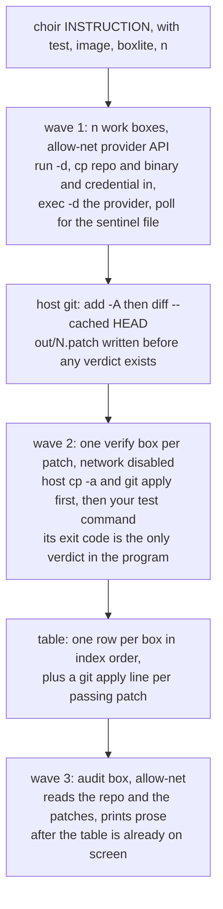

# Architecture



Six boxes on the diagram is the whole program. The three waves are three literal blocks
of code in `main`, not a stage type, not a list of stages, and not a pipeline.

Boxes inside a wave run at the same time; Choir itself never issues two BoxLite commands
at once, because BoxLite takes an exclusive lock on `BOXLITE_HOME` and concurrent
invocations fail with "Another BoxliteRuntime is already using directory". It does not
need to: every host-side call is short. Measured on this machine with the patched 0.9.7
CLI — `run -d` 0.58 s, `cp` in 0.06 s, `exec -d` 0.10 s, poll 0.10 s, `cp` out 0.07 s,
`rm -f` 0.11 s. The parallelism lives inside the microVMs, not in Choir.

## Paths

Choir writes in exactly two places and touches nothing else:

- `<out>/N.patch`, one per work box. `--out` defaults to `./choir-out`, relative to the
  user's current directory, so it lands in the working tree if Choir is run from inside
  the repo. A second run with the same `--out` overwrites `N.patch`; Choir does not
  version, timestamp, or refuse — the README says so and that is the whole treatment.
- one `mktemp -d`, deleted before the last line of `main`. It holds exactly four kinds of
  entry: `repo/` (one `cp -a` of `--repo`, the input to every box and the base for every
  verify tree), `patches/` (the same bytes as `<out>`), `N/` (what came back out of box N),
  and `verify_N/` (a copy of `repo/` with `N.patch` applied).

Box names are `<basename of the mktemp dir>-<index>`. That makes them unique per run, so
two Choir runs on one machine cannot destroy each other's boxes, and it is why there is no
startup sweep of stale boxes — a sweep that guesses which boxes are yours is a reconciler.

`boxlite cp` nests: `cp <host>/repo <box>:/` produces `/repo` in the guest, and
`cp <box>:/repo <run>/N` produces `<run>/N/repo` on the host. Verified both directions.
That nesting is the only reason the scratch directory has fixed names: the guest paths
`/repo` and `/patches` are literals in the provider command lines and in the audit prompt,
and they stay literals only because the host directories are called `repo` and `patches`.
Interpolating the user's `--out` basename into the prompt instead would be a template.

## Dependencies

`gleam.toml` names five packages and no others: `gleam_stdlib` 1.0.3, `shellout` 1.8.0,
`simplifile` 2.6.0, `argv` 1.1.0, and `gleeunit` 1.11.0 (dev). `filepath` arrives transitively
behind `simplifile`. Every version here was read off hex while writing this document; they are
the latest releases, not pins, and Choir asserts nothing about them at runtime.

## Components

**argv parse and plan.** Parses the flags in the README and produces
`List(#(index, provider, box_name))`. Provider is `providers[index mod length]`, computed
once before anything runs. `--providers` accepts exactly the words `claude` and `codex`.
Round-robin is the whole fault-tolerance story: a rate-limited Claude degrades a run
instead of ending it.

**The box driver.** One function, used by all three waves with different arguments:
`run -d --name <n> --disk-size <const> <net flags> <image> sleep 86400` to get an idle
box, `cp` the inputs in, `exec -d` the real work, poll, `cp` the tree out, `rm -f`. The
order is forced: the work cannot be the box's foreground command because the repository
is not in the box when `run` returns, and it cannot be a blocking `exec` because a
blocking exec holds the runtime lock for its whole duration and cannot then be killed.
The `sleep` is only there because `run` requires a command, and its argument is arbitrary:
a box whose foreground `sleep 12` had long expired still accepted `exec` and served `cp` at
t = 16 s. The guest cannot end itself, so `rm -f` is the only thing that ends a box, and a
Choir killed mid-run leaks its boxes with the credential still inside them.

The detached command is one string in every wave:

```
<real command> < /dev/null > /out.log 2>&1; echo $? > /exit.txt
```

`< /dev/null` because a provider CLI that reads stdin under `exec -d` waits forever.
`/exit.txt` and `/out.log` sit outside `/repo` because `git add -A` would otherwise sweep
them into every patch.

**The two provider command lines.** Two arms of one `case`, written out, no model id and
no version:

```
claude -p <instruction> --dangerously-skip-permissions
codex exec --skip-git-repo-check --dangerously-bypass-approvals-and-sandbox <instruction>
```

with `-w /repo` on the `exec` and `-e CLAUDE_CONFIG_DIR=/cred` or `-e CODEX_HOME=/cred`.
The same `case` holds the two `--allow-net` host lists. A third provider is an edit to that
`case` by someone who has run the new CLI. There is no provider record, no capability table,
and no argv builder.

Every box in every wave boots the same `--image`. There is no `--verify-image` and no
per-wave override: one image that can run the provider and run your tests is the price of
admission, and it is stated in the README.

**The shell-out capture site.** One function running an argv through `shellout.command`,
returning exit code plus bytes, with the UTF-8 guard applied exactly once: coerce the
returned value through `@external(erlang, "erlang", "iolist_to_binary")` to a `BitArray`
and run `bit_array.to_string`. Without the guard, one invalid byte anywhere in provider or
BoxLite output crashes Choir with `erlang:error(Badarg)` inside `gleam/string` —
shellout's `Result(String, #(Int, String))` is a lie at the FFI boundary. That external
attribute names a real Erlang BIF, so there is no FFI source file.

**Patch extraction.** Host-side `git -C <run>/N/repo add -A` then
`git diff --cached HEAD`, written to `<out>/N.patch` and `<run>/patches/N.patch`
immediately. No git is needed inside the guest for this. Writing the files before computing
any verdict is what makes it structurally impossible for Choir to discard work a provider
produced.

**Verify prep.** `cp -a <run>/repo <run>/verify_N` then `git apply <out>/N.patch`, host
side, before the verify box starts. Without it, "the patch does not apply" and "the tests
failed" collapse into one nonzero exit code and the table cannot tell you which happened.
It also means the verify box tests the patch, not the provider's dirty working tree.

**Report.** One row per box in index order, then a `git apply` line per passing patch,
then the audit prose. It is the entire user interface and the entire selection mechanism.

**The audit prompt.** The only string Choir itself sends to a model. One sentence, a
literal, no interpolation:

> Read the repository at /repo and the patches at /patches. Say what is wrong with each
> one.

## Decisions

**Provider inside the guest, not proxied from the host.** Rejected: run the provider on
the host and proxy its tool calls into the box over MCP or a Unix socket. That is what v2
built and it cost roughly 4,900 lines (`choir_sandbox_mcp.mjs` 870, `mcp_mode.mbt` 812,
`translate.mbt` 733, `uds/stub.c` 316, plus the rest). It also does not reduce the risk it
appears to address: it moves the same unscoped OAuth token to a host process with
unrestricted network. Codex has been run inside a BoxLite box on a real subscription with
`--allow-net`, authenticated, and used real tokens.

**One credential file, copied in.** Rejected: bind-mounting `~/.claude` or `~/.codex`.
Both CLIs write refreshed tokens and session state into their config directory, which
means `rename()`, which kills the box (below). Rejected: a host-side credential-injecting
proxy — virtiofs does not pass Unix sockets and a network-disabled box has no interface,
so the guest cannot reach one. `CLAUDE_CONFIG_DIR` / `CODEX_HOME` pointed at a directory
containing only `.credentials.json` / `auth.json` works, and everything else self-creates,
so the box never sees host hooks, plugins, MCP servers, skills, or history. The provider
binary is resolved with `readlink -f` and copied: `~/.local/bin/claude` is a symlink into a
versions directory, and `codex` resolves to a path inside `~/.codex` next to the credential.

**`boxlite cp` in and out, never a writable `-v` mount.** Rejected: bind-mount the repo
copy and read the patch through it, which is faster and simpler and does not work. `mv` on
a writable virtiofs mount kills the box with an h2 transport error; so does `chmod`.
`sed -i`, `git`, and every editor's write-temp-then-rename do exactly that, so a mounted
repo dies on the provider's first edit. Guest-local `mv`/`sed` work fine, and a `cp` round
trip was verified to carry modifications, new files, deletions, and file modes. Read-only
mounts are safe but unnecessary — the only inputs are a repo, a binary, and a credential,
and `cp` handles all three.

**Completion is a sentinel file polled through `exec`.** Rejected: polling
`boxlite ls --format json`. Measured twice: a box whose command exited at t≈4 s still
reported `"Status": "Running"` at t = 1, 3, 6, 9 and 14 s, and a box whose foreground
`sleep 12` had expired still reported `Running`, still accepted `exec`, and still served
`cp` at t = 16 s. Status is not a completion signal and the box's own foreground command is
not a deadline. The guest's last act is `echo $? > /exit.txt`; the host polls
`exec <box> -- sh -c 'cat /exit.txt 2>/dev/null || echo PENDING'`.

**The deadline is a poll count, and Choir has no clock.** `--timeout` divided by the poll
interval gives the number of rounds; each round polls every still-pending box and then waits
by shelling out to `sleep`. Polling costs about 0.1 s per box, so the real deadline overshoots
the nominal one by a few percent and can never fire early. None of the five dependencies
exposes a clock, and adding one buys an elapsed-time column nobody needs — `time choir …`
prints it.

**`boxlite rm -f` is the only cancellation.** Rejected: a guest-side `timeout -k` wrapper —
it adds a flag, builds a shell string, and silently requires `timeout(1)` in a user-supplied
image, and the box outliving its own foreground `sleep` shows guest-side deadlines are not
trustworthy here anyway. Rejected: killing anything from the BEAM — `process.kill` on the
owning BEAM process leaves the OS child alive, and the child survives the VM exiting. `rm -f`
destroys a microVM, and a microVM's processes cannot outlive its kernel: measured at
0.11–0.12 s against a box ignoring TERM, INT and HUP, with no orphans. It works because Choir
never blocks in a BoxLite call, so the lock is always free when the deadline fires.

**No concurrency inside Choir, and no library that offers any.** Rejected: BEAM fan-out with
`spawn_unlinked` and monitors (~60 lines). There is nothing to fan out — no host-side call
runs longer than 0.6 s. Rejected: `gleam_otp`; version 1.2.0 has no `task` and no generic
supervisor anyway, and supervision is meaningless for a synchronous command holding no state.
Rejected: `gleam_erlang`, whose only use here would have been `process.sleep` between polls —
`sleep` is a command and Choir already runs commands, so the poll wait costs a `shellout` call
instead and the OTP process API is not in the dependency tree at all. Checked on hex: none of
`shellout` 1.8.0, `simplifile` 2.6.0, `argv` 1.1.0 or `gleeunit` 1.11.0 depends on
`gleam_erlang`, so nothing pulls it back in transitively. Rejected: one
`BOXLITE_HOME` per box, reflink-cloned from a warm seed. Multiple detached boxes coexist in
one home; the clone approach costs ~700–950 MB each, inherits the source home's box records
so each clone "recovers" boxes it does not own, and silently degrades to full copies when the
run directory is on tmpfs, which is where `mktemp -d` puts it.

**Verification is your test command's exit code, and nothing else.** Rejected: reading
`is_error`, `subtype`, `permission_denials`, or any other provider self-report. A Claude
session blocked on a permission prompt exits 0 with `is_error: false` and
`subtype: "success"` having done nothing. Rejected: any Choir-defined gate on the patch —
size caps, path scoping, ownership checks, structural validation. In v2's production logs not
one Goal died because the work failed; every one died to a Choir gate, including
`PartOwnershipViolation`, which discarded completed provider work for touching the wrong
file. There is exactly one place in Choir that produces a pass/fail and it reads a process
exit code.

**Choir does not select a patch.** Rejected: auto-selecting "passed tests, then smallest
diff"; a score; a ranked recommendation. Selection needs a total order over patches and every
available order is wrong where it matters — smallest-diff rewards deleting the failing test.
The test command is a filter. Rows print in box order; the only number in the table is a byte
count, there is no `--stat` column and no sort, because a metric plus a sort key is one
tiebreak from a score and a score is one flag from auto-apply.

**The audit box runs after the table is printed.** Rejected: an audit verdict field, an audit
column, audit-gated application. Ordering makes blocking structurally impossible rather than
merely forbidden: by the time the auditor speaks, the patches are on disk and the user has
already seen the answer, so an audit box that hangs, crashes, or reports catastrophe cannot
remove a patch.

**`--boxlite` is a required flag.** Rejected: searching `PATH`. On the machine this was
designed on, the `boxlite` on `PATH` is the unpatched release and fails 100% of boxes.
Rejected: verifying the binary by sha256 before spawning. That is a version pin, and v2's
version pin (`surface_probe.mbt`, 477 lines with an `exact_version` field) produced six
qualification commits in twelve days — and the installed Claude Code moved 2.1.220 → 2.1.221
during the writing of these three files. Choir prints BoxLite's stderr verbatim and says
nothing about what it means.

**`--disk-size` is a constant, not a flag.** Unset, the overlay is sized to exactly the base
image with no headroom, and copying a 276 MB provider binary in fails with an opaque storage
error that then poisons every later copy into that box. `boxlite run --help` documents the
overlay as sparse, so a large virtual size costs nothing on disk.

## Failure model

**OTP supervision handles nothing, because there is none.** No actor, no supervisor, no
`gleam_otp` dependency, no `spawn`. Choir is one BEAM process running a sequence of short
external commands. Supervisors restart long-lived services that hold state; Choir holds no
state, exits when the run finishes, and restarting a box that just spent twelve minutes of
paid provider time is worse than reporting the failure. That is how v2 retried decomposition
seven times against its own validator.

**Reported to the user, per box:** the exit code of the work, the size of the patch, the
verdict of the test command, and the last line of `/out.log`, read with one `exec` before
teardown. When a BoxLite command fails, its stderr verbatim.

**Deliberately not handled.** A box that produces nothing is a row, not an error — Choir does
not know whether it was rate-limited, logged out, refused, wedged, or unable to solve the
problem, and the provider signals that would be needed to tell them apart are not trustworthy.
There is no retry, no failover to the other provider, no backoff, no preflight auth check, no
dirty-tree check, and no capacity model. If the host runs out of network devices or memory at
high N, the BoxLite error is printed and that box's row says so. Every box name is known in
advance and every name is `rm -f`'d at the end of its wave regardless of what happened,
because `--rm` does not fire for a box in this lifecycle and cleanup must be tolerant rather
than fail-closed. If `rm -f` itself fails, the error is printed and ignored.

**Choir killed mid-run leaks boxes.** `rm -f` never runs, so the boxes stay up with the
credential inside them; `boxlite rm -f -a` is the user's cleanup and it is in the README.
Rejected: a startup sweep, an exit trap, a `--cleanup` subcommand, a PID file. Every one of
them is a reconciler for state Choir is not supposed to have, and a sweep cannot tell a
concurrent run's boxes from an abandoned one's.

## What has not been verified

Two things. Both are stated in the README as well; neither has a code answer.

**The sandbox-bypass flags.** It has never been tested end to end that
`--dangerously-skip-permissions` and `--dangerously-bypass-approvals-and-sandbox` let a
provider do real work inside a guest that has no `bubblewrap`. A real billed Codex session
inside a stock Alpine box authenticated correctly and then could not read a file, printing
`Codex could not find bubblewrap on PATH`, and returned exit 0 with an empty patch — which is
v2's death (paid time burned, nothing returned, no distinguishable signal) reproduced inside
this design. Testing it requires a billed session with a credential inside a box; three
successive attempts were blocked by their harness. If the flags are not enough, the fix is one
more line in the README's image requirements, not code.

**The Claude allow-net host list.** `--allow-net chatgpt.com --allow-net ab.chatgpt.com`
carried a real authenticated Codex session. The equivalent list for Claude Code has never
carried one. It is a literal in the same `case` as the command lines, and when it is wrong the
symptom is the provider's own auth error printed in the box's last line. Do not add a probe, a
retry on auth failure, or a configurable host list — fix the literal.

## Limits of the isolation boundary

The guest cannot read the host filesystem, other repositories, SSH keys, or host processes: it
is a microVM with its own kernel, nothing is bind-mounted, and only the repo copy, one provider
binary, and one credential file are copied in.

`--allow-net` is a guardrail, not an exfiltration boundary. Measured on this runtime: UDP
egress is entirely unfiltered; the DNS sinkhole is bypassed by querying an explicit resolver;
and any host service on `127.0.0.1` is reachable from a networked box at `192.168.127.254`. The
guest kernel has no netfilter, so this cannot be closed from inside. Only the verify boxes,
which run no provider, are `--network disabled`, and that one is real: verified to have `lo`
and nothing else, with no `eth0` and no route of any kind.

The credential in a provider box is a full-account OAuth token with a refresh token and no
scoping, because neither vendor mints anything narrower. The provider runs with its own
permission checks disabled, so the model has full control of the guest by design.

**Conflict with `docs/goal.md`.** That document says Choir spawns "N network-disabled BoxLite
microVMs". A subscription-authenticated provider CLI cannot run in one: `--network disabled`
gives the guest no `eth0`, and `boxlite run --help` states `--allow-net` is "Incompatible with
`--network disabled`". Only the verify boxes are network-disabled; the work boxes and the audit
box use `--allow-net`. Amending the binding document is the owner's decision, not an agent's,
and until it is amended this paragraph is the honest description of what runs. Either way
there is no user-facing network flag and never will be: which mode a box gets is decided by
which wave it is in, in the same three literal blocks of `main` as everything else.
