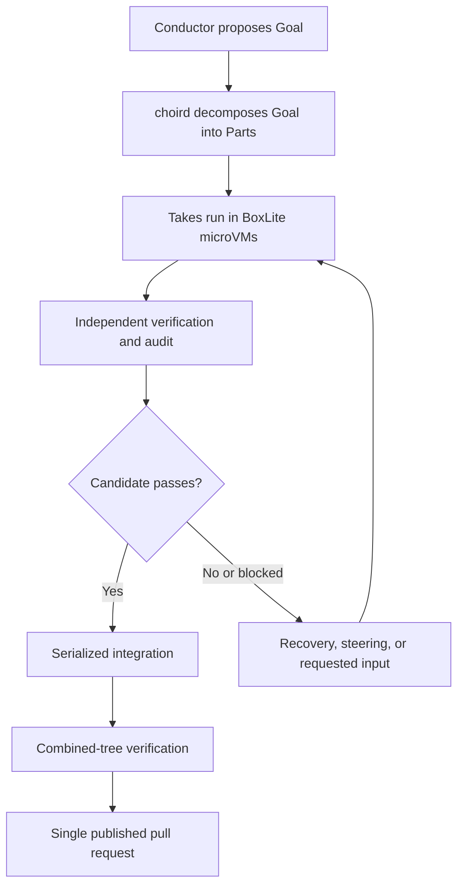

# Documentation

Choir is a durable, sandboxed orchestration system for Claude Code and Codex coding agents: an interactive Conductor proposes a Goal, `choird` records and decomposes the accepted work into Parts, subscription-backed Takes run in BoxLite microVMs, candidates are independently verified and audited, and successful work is integrated serially, verified as a combined tree, and published as one pull request. The current workflow targets Linux with KVM; the first two migration slices are implemented, while later migration slices and the native macOS host port remain staged or deferred work as described by the charters.

## Index

- [Architecture charters](charters/README.md)
- [BoxLite runtime](boxlite-runtime.md)
- [Migration slice 1 verification](migration-slice1-verification.md)
- [Migration slice 2 verification](migration-slice2-verification.md)
- [Operational runbooks](runbooks/)

## Workflow

