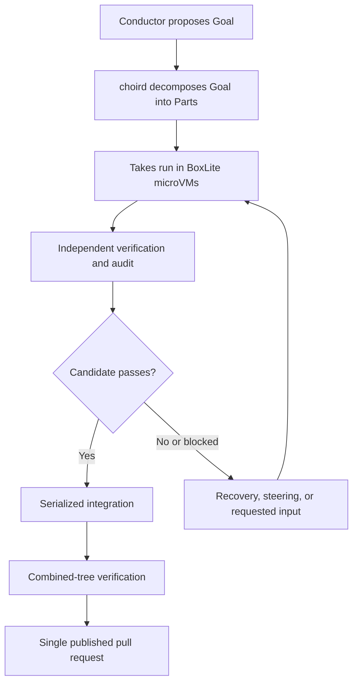

# Documentation

Choir runs Claude Code and Codex implementation Takes in network-disabled BoxLite microVMs, independently verifies their bounded patches with MoonBit, and applies a direct Take only on explicit request after identity checks. Durable Goals add independently audited Parts, receipt-bound serialized integration, combined-tree assurance, and one reviewed pull request. The current host is Linux with KVM, and repository verification is limited to controlled `moon` commands.

## Index

- [Security boundary](security-boundary.md)
- [`choir take` comparison attempt](evaluations/choir-take-comparison.md)
- [BoxLite runtime](boxlite-runtime.md)
- [Migration slice 1 verification](migration-slice1-verification.md)
- [Migration slice 2 verification](migration-slice2-verification.md)
- [Dependency and runtime upgrades](runbooks/dependency-upgrades.md)
- [Goal troubleshooting](runbooks/troubleshooting.md)

## Workflow

```mermaid
flowchart TD
    A["Conductor proposes Goal"] --> B["choird decomposes Goal into Parts"]
    B --> C["Takes run in BoxLite microVMs"]
    C --> D["Independent verification and audit"]
    D --> E{"Candidate passes?"}
    E -->|Yes| F["Serialized integration"]
    E -->|No or blocked| R["Recovery, steering, or requested input"]
    R --> C
    F --> G["Combined-tree verification"]
    G --> H["Single published pull request"]
```
