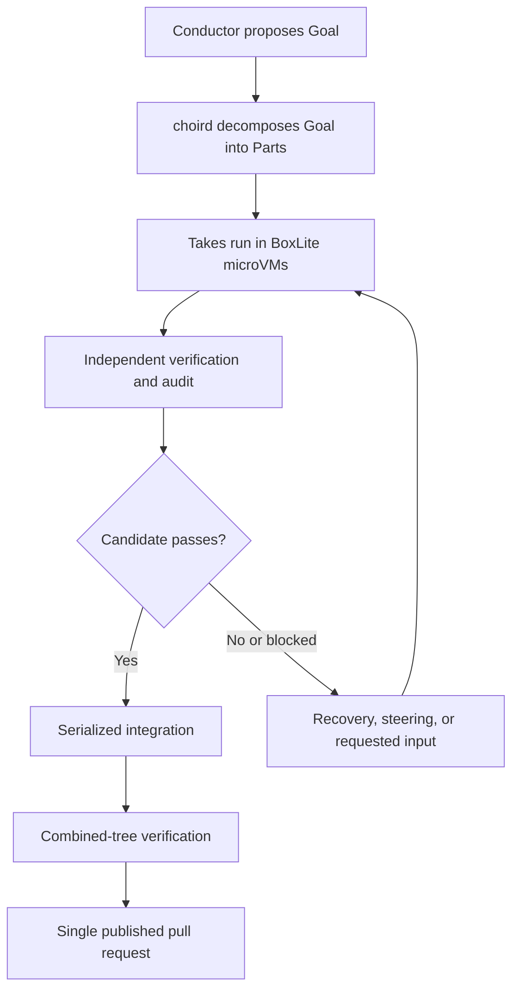

# 文档

Choir 是一个面向 Claude Code 和 Codex 编程智能体的持久化沙箱编排系统：交互式 Conductor 提议 Goal，`choird` 记录已接受的工作并将其分解为 Parts，由订阅支持的 Takes 在 BoxLite microVM 中运行，候选结果经过独立验证与审计，成功的工作随后被串行集成、以组合后的代码树进行验证，并作为单个拉取请求发布。当前工作流以启用 KVM 的 Linux 为目标；迁移工作的前两个切片已实现，而后续迁移切片和原生 macOS 主机移植仍是章程中所述的分阶段或延期工作。

## 索引

- [架构章程](charters/README.md)
- [BoxLite 运行时](boxlite-runtime.md)
- [迁移切片 1 验证](migration-slice1-verification.md)
- [迁移切片 2 验证](migration-slice2-verification.md)
- [运维手册](runbooks/)

## 工作流

