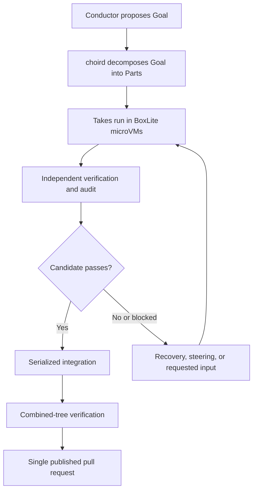

# 文档

Choir 在禁用网络的 BoxLite microVM 中运行 Claude Code 和 Codex 的实现 Take，使用 MoonBit 独立验证有大小限制的补丁，并且仅在明确请求且身份复核通过后应用直接 Take。持久化 Goal 在此基础上增加独立审计的 Part、与收据绑定的串行集成、组合代码树保证以及一个供审查的拉取请求。当前主机平台是启用 KVM 的 Linux，仓库验证仅支持受控的 `moon` 命令。

## 索引

- [安全边界](security-boundary.md)
- [BoxLite 运行时](boxlite-runtime.md)
- [Goal 故障排查](runbooks/troubleshooting.md)

## 工作流

```mermaid
flowchart TD
    A["Conductor proposes Goal"] --> B["choird decomposes Goal into Parts"]
    B --> C["Takes run in BoxLite microVMs"]
    C --> D["Independent verification and audit"]
    D --> E{"Candidate passes?"}
    E -->|Yes| F["Serialized integration"]
    E -->|No or blocked| R["Recovery, steering, or requested input"]
    R --> C
    F --> G["Combined-tree verification"]
    G --> H["Single published pull request"]
```
